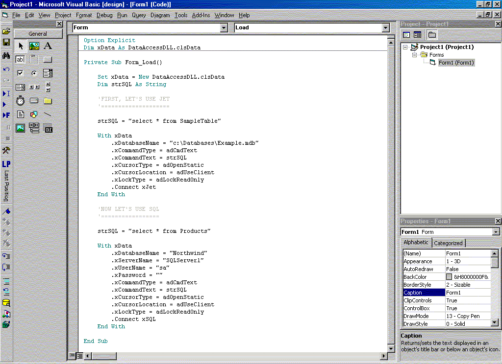



## DataAccessDLL

### Description

** PLEASE VOTE FOR MY CODE - EVEN IF YOU DON'T LIKE IT **

GREATLY simplifies accessing JET or SQL Server databases. No more Connection String, provider, data source, Persist Info etc. properties to fill in. Provides easy to follow instructions right inside the DLL.
 
### More Info
 
SQL - user id, password, authentication mode, server name, command text

JET - database name, command text

A basic knowledge of ADODB is helpful, SQL statements (select * from whatever)

ADODB Recordset(s) - can be used as an array for multiple recordset retrieval.

             |
---                |---
**Submitted On**   |2001-06-21 10:31:56
**By**             |[Austin K\. Hayward](https://github.com/Planet-Source-Code/PSCIndex/blob/master/ByAuthor/austin-k-hayward.md)
**Level**          |Advanced
**User Rating**    |4.7 (70 globes from 15 users)
**Compatibility**  |VB 4\.0 \(32\-bit\), VB 5\.0, VB 6\.0, VB Script, ASP \(Active Server Pages\) , VBA MS Access
**Category**       |[Databases/ Data Access/ DAO/ ADO](https://github.com/Planet-Source-Code/PSCIndex/blob/master/ByCategory/databases-data-access-dao-ado__1-6.md)
**World**          |[Visual Basic](https://github.com/Planet-Source-Code/PSCIndex/blob/master/ByWorld/visual-basic.md)
**Archive File**   |[DataAccess214566212001\.zip](https://github.com/Planet-Source-Code/austin-k-hayward-dataaccessdll__1-24284/archive/master.zip)

